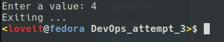

# DevOps task

The program is written in Python. It represents console application
with looped menu, which requires users input to CLI. Example:

```
python3 script.py <input_file1> <input_file2>
```

Code style of script matches following rule:

- [PEP 8](https://www.python.org/dev/peps/pep-0008/) - Style Guide for Python Code

File README.md formatted with following rule:

- [REAMDE.md template](https://gist.github.com/PurpleBooth/109311bb0361f32d87a2) - Correct, short and contentfull formatting

Stamp of date and time initialized as a constant variable in the script,
and it prints on the head line of the program execution.

## Dependencies

### Windows

If you are a Windows user, at first, you need to [add new path to your environment variable 'Path'](https://www.mathworks.com/matlabcentral/answers/94933-how-do-i-edit-my-system-path-in-windows)
Then you need to [install pip](https://www.geeksforgeeks.org/how-to-install-pip-on-windows/)
The last step is execute following commands in the command prompt (cmd):

```
pip install colorama
pip install termcolor
```

### Linux

You just need execute these commands in the terminal:

```
pip install colorama
pip install termcolor
```

And then you can [execute this script](https://github.com/ViNN280801/DevOps_task#devops-task) without any errors or warnings

### Description of methods are written in the 'script.py' as comments

## How to use

### Iterating in the menu

General view of menu


Enter a '1' value


Example of viewing a file


Enter a '2' value


Enter a '3' value


Enter a '4' value



### Handling errors

Entering a string instead of the number


Entering incorrect number


[To the beginning](https://github.com/ViNN280801/DevOps_task#devops-task)
