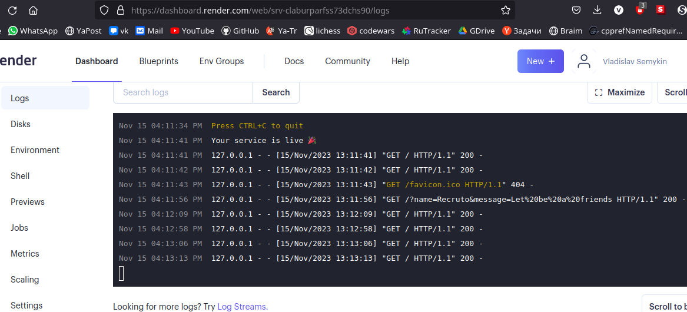
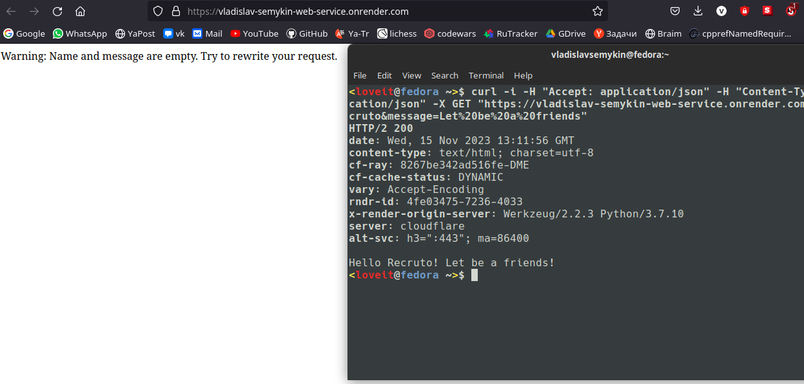

# Greeting Service

A simple Flask-based web service that generates greetings based on provided 'name' and 'message' parameters in a GET request.

## Dependencies Installation

Before running the application, ensure all required dependencies are installed by executing the `inst_dependencies.py` script (<b>but it will be automatically ran if you start script `main.py`</b>):

```bash
py inst_dependencies.py
```

## Running the Application

To start the application, run the main.py file:

```bash
py main.py
```

The application will start a Flask development server on http://127.0.0.1:5000/ by default.

## Usage

The service responds to GET requests made to the root URL ("/") with query parameters 'name' and 'message':

### Example Request:

```bash
curl -i -H "Accept: application/json" -H "Content-Type: application/json" -X GET "http://127.0.0.1:5000/?name=Your_Name&message=Your_Message"
```

### Response:

- If both 'name' and 'message' are provided, the service responds with a greeting:

Hello Your_Name! Your_Message!

- If 'name' or 'message' is missing or empty, it returns a warning message indicating the missing parameter:

```
Warning: Name is empty. Try to rewrite your request.
```

- If an exception occurs during execution, it returns an exception message:

```
Exception raised: Exception_Message.
```

## Testing

The service has been tested using curl commands with different combinations of 'name' and 'message' parameters. Also you can see the file `test_commands.txt` to see all cases (except of exceptions):

- Valid input with 'name' and 'message'
- Empty 'name'
- Empty 'message'
- Both 'name' and 'message' empty
- Only 'name' empty
- Only 'message' empty
- No 'name' and 'message'

## Example

I used [Render](https://dashboard.render.com) platform to deploy my web-service.

Deploying the web-service:


Sending `GET` request to it:

> ```bash
> curl -i -H "Accept: application/json" -H "Content-Type: application/json" -X GET "https://vladislav-semykin-web-service.onrender.com/?name=Recruto&message=Let%20be%20a%20friends"
> ```



## Note

This service is designed for demonstration purposes and might require additional error handling or modifications for production use.

## Links to the deployed web-services

- https://vladislav-semykin-web-service.onrender.com
- https://vladislav-semykin-web-service-task2.onrender.com
- https://vladislav-semykin-web-service-task3.onrender.com
