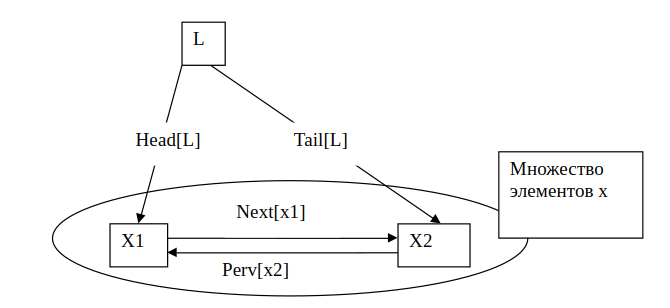

# Test task for "ООО Бизнес Технологии"

## Description of stage 1

написать реализацию сортировки mergeSort.

## Description of stage 2

### Псевдокод

Данный псевдокод используется для описания алгоритмов.

1. Отступ от левого поля указывает на уровень вложенности.
2. Циклы while, for, repeat и условные конструкции имеют тот же смысл что и в pascal-е.
3. Символ “--” обозначает комментарий
4. Символ “:=” обозначает присваивание
5. Переменные локальны в рамках процедуры если, не оговорено иначе.
6. Индекс массива пишется в квадратных скобках, конструкция A[i] означает i элемент в массиве A
7. Возможно использование объектов, состоящих из нескольких полей, или имеющих несколько атрибутов, значения поля записывается как ИмяПоля[ИмяОбъекта].

К примеру длинна массива A записывается как Length[A], что означают квадратные скобке выясняется по контексту, переменная обозначающая массив или объект является указателем на составляющие его данные, после присвоения y:=x для любого поля f будет выполнятся равенство f[y]=f[x], определение того что является атрибутом, функция переменная или что либо еще делается по контексту. 8. Указатель может иметь специальное значение NIL не указывающая ни на какой объект. 9. Параметры передаются по значению: вызванная процедура получает собственную копию параметров, изменения параметров внутри процедуры снаружи не видно. При передаче объектов копируется указатель на данные соответствующие этому объекту.

### Задача по анализу алгоритма

Insertion-Sort(A)
1 for j :=2 to length[A] 
2   &nbsp;do key := A[j] 
3   &nbsp;i :=j - 1 
4   &nbsp;while i > 0 and A[i] > key 
5       &nbsp;&nbsp;do A[i + 1] :=A[i] 
6       &nbsp;&nbsp;i :=i - 1 
7       &nbsp;&nbsp;A[i + 1] := key 

Опишите работу представленного выше алгоритма.
Достаточно составить таблицу, где для каждой итерации цикла по переменной j будет представлена строка с указанием порядка перемещений для каждого элемента. К примеру:

|  j  | A[1] | A[2] | A[3] | A[4] |
| :-: | :--: | :--: | :--: | :--: |
|  1  |  3   |  2   |  1   |  5   |
|  2  |  3   |  2   |  1   |  5   |

### Задача по написанию алгоритма вставки в список

В связанном списке элементы линейно упорядочены, но порядок определяется не номерами, как в массиве, а указателями, входящими в состав элементов списка. Списки являются удобным способом реализации динамических множеств, позволяющим реализовать все операции, необходимые для работы с данными. Другими словами элемент двухстороннего связанного списка – это запись содержащая три поля Key (Ключ) и два указателя Next(Следующий) и prev (Предыдущий ) Помимо этого, элементы списка могут содержать дополнительные данные. Если х-Элемент списка То next[x]. Указывает на следующий элемент списка, а prev[x] – на предшествующий. Если prev[x]=NIL, то у элемента x нет предшествующего: это голова(Head) списка. Если next[x]=NIL, то x - последний элемент списка или, как говорят его хвост (tail)
Прежде чем двигаться по указателям, надо знать хотя бы один элемент списка: мы предполагаем, что для списка L известен указатель head[L] на его голову. Если head[L]=NIL, то список пуст.
Для примера дана процедура поиска по списку:

Алгоритм поиска
List-Search(L; k)
1 x :=head[L] 
2 while x != nil and key[x] != k 
3   &nbsp;do x :=next[x] 
4 return x

Если забыть о ситуации, когда удаляется 1 или последний элемент списка то алгоритм удаления может быть записан в виде
List-Delete(L; x)
1 next[prev[x]]:=next[x] 
2 prev[next[x]]:= prev[x]

Рис. списка:

</img>

<b>Напишите процедуру вставки элемента в голову списка.</b>
Учесть, что элемент списка может быть пустым.
Декларация вызова:

List-Insert(L; x)
(L – указатель на список, x-указатель на элемент списка)

### Задача по распределению сумм

Товарная позиция документа содержит три поля: количество, цена и сумма. Детализация товарной позиции документа содержит распределение количеств и сумм по людям. Количества в детализации вводятся вручную, суммы вычисляются автоматически.
Точность округления сумм – 2 знака, количества – 10 знаков.
Пример:
Товарная позиция

|  Номенклатура  | Количество (кг) | Цена | Сумма (руб.) |
| :------------: | :-------------: | ---: | -----------: |
| Сахарный песок |   58,21942216   |   10 |       582,19 |

Детализация:

| Фамилия  | Количество (кг) | Округленное количество \* Цену | Распределение копеек |        Сумма |
| :------: | :-------------: | :----------------------------: | -------------------: | -----------: |
|  Иванов  |   30,88848888   |          308,88000000          |                 0,02 | 308,90000000 |
|  Петров  |   5,88848888    |          58,88000000           |                 0,01 |  58,89000000 |
| Сидоров  |   5,88848888    |          58,88000000           |                    0 |  58,88000000 |
| Малевин  |   5,88848888    |          58,88000000           |                      |  58,88000000 |
| Макаров  |   5,88848888    |          58,88000000           |                      |  58,88000000 |
| Сетченко |   1,88848888    |                                |                      |              |
|  Козлов  |   1,88848888    |                                |                      |              |
|  Итого   |   58,21942216   |          582,16000000          |                      | 582,19000000 |

Примечание: серым курсивом отображены служебные поля, демонстрирующие расхождения по копейкам, а также корректный разброс суммарного расхождения по позициям.

Необходимо вычислить суммы по позициям разбрасывая итоговые расхождения по копейкам при округлении, пропорционально количеству в позиции.

Задача:

- Вычислить значение колонок «Округленное Количество\*Цену», «Сумма» и «Распределение копеек» для «Сетченко» и «Козлова»
- Написать формулы, по которой вычисляется колонка «Распределение копеек», для Иванова, Петрова, Сидорова.
- Найти формулу, по которой вычисляется колонка «Сумма».
- Написать общий алгоритм вычисления по детализации.
